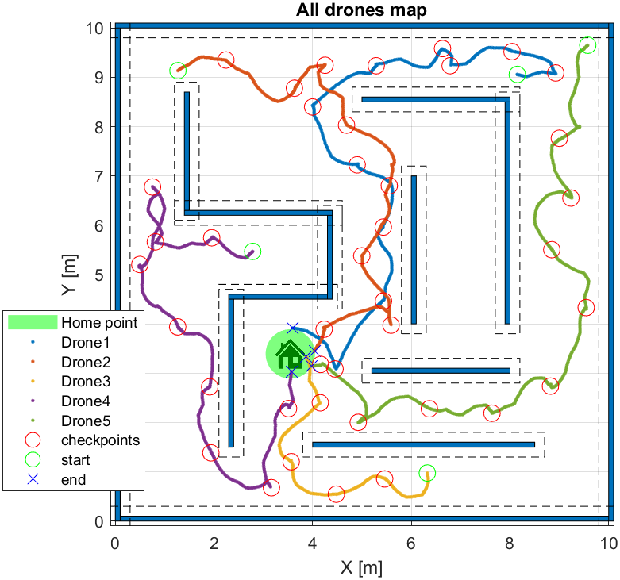
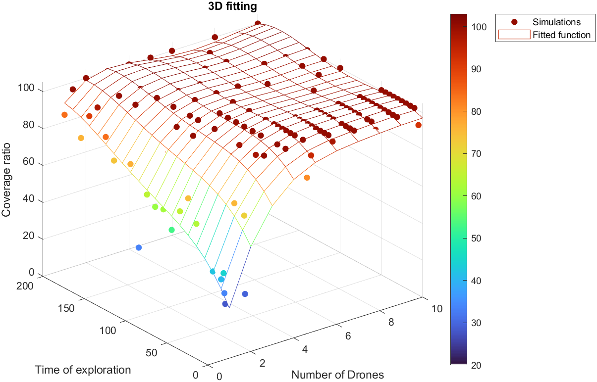

# LiDflAIR: Intelligent Distributed System Project

      


## Description
Gabriele Tonelli and Matteo Zumerle, both Master's students in Mechatronics Engineering, present the work done as part of the Intelligent Distributed System course project. The students created a flexible environment and a distributed system capable of mapping an unknown environment provided by the user. The outcome generated is a reconstructed map with a relative comparison to the original starting one.

## Installation
To install and set up the project is sufficient to clone the repository or to directly download and open the main root in MATLAB.

## Utilization
In the folder are present different codes
- In ```FULL_SINGLE_MAIN``` is possible to tune and run a single simulation for given number of drones and time of exploration.
- In ```MULTIPLE_SIM_MAIN``` is possible to tune and run multiple simulations in one shot in order to collect more data rapidly (no plots present).
- In the folder ```functions``` are collected all the functions used in the project, including plot functions.
- In the folder ```utilities``` there a two little script that helps to have a preview of the selectable maps and to study the results from past simulations.
- In the folder ```Simulation_data``` are stored the output data files from the simulations.
- In the folder ```pictures``` are present some pictures used in plots and the logo.

  
